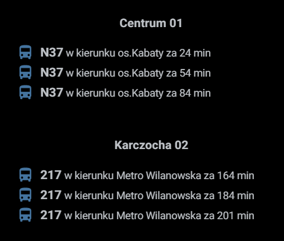

# Lovalace custom stop card for ZTM - Warsaw public transport information
This Lovelace custom card displays Warsaw Public Transportation (ZTM) line information departing in the near future from a configurable stop sensor.

This custom card depends on the ZTM - Warsaw public transport sensor that you may find at https://github.com/peetereczek/ztm.

Lovelace UI does not support custom sensor attributes natively, thats why you need to use custom card for pretty output in our UI.
Inspired by [BKK Stop Card](https://github.com/amaximus/bkk-stop-card) and [Entity Attribute Card](https://github.com/custom-cards/entity-attributes-card)

#### Installation
The easiest way to install it is through [HACS (Home Assistant Community Store)](https://custom-components.github.io/hacs/),
search for <i>ztm</i> and select ZTM Stop Card from Plugins.<br />
If you are not using HACS, you may download ztm_stop_card.js and put it into $homeassistant_config_dir/www.<br />

#### Lovelace UI configuration
Add the following lines to your ui-lovelace.yaml (entity should be the sensor of ztm platform you defined):
```
resources:
  - {type: module, url: '/www/community/ztm_stop_card/ztm_stop_card.js'}

    cards:
      - type: custom:ztm_stop_card
        entity: sensor.ztm_...<rest of sensor name>
      - type: custom:bkk-stop-card
        entity: sensor.ztm_ ...<rest of sensor name>
```

Lovelace UI:<br />

